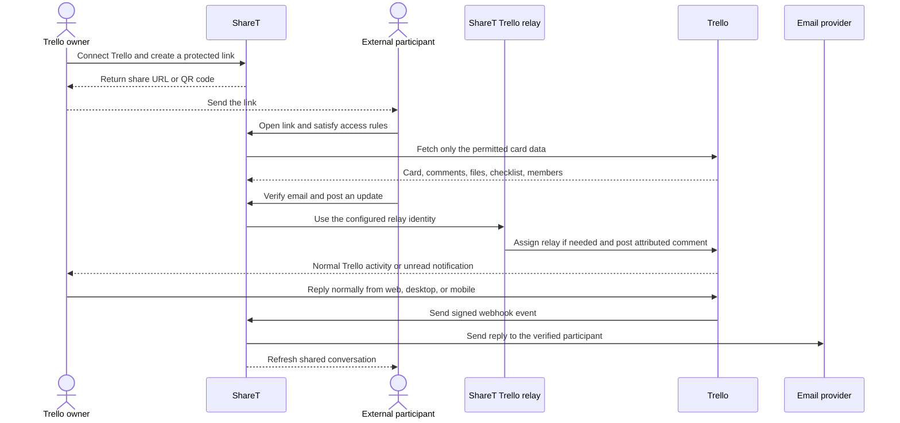

# ShareT

ShareT gives people controlled access to Trello work without requiring them to have a Trello account.

A Trello owner creates a link for a card—or creates one link per card in a list—and sends it to a freelancer, contractor, client, volunteer, or other external participant. The recipient opens a normal web page where they can see the permitted card information, verify their email, upload or download attachments, and post progress updates. ShareT relays those updates into Trello so the owner can continue working from Trello web, desktop, or mobile.

> [!IMPORTANT]
> ShareT is a production-oriented **owner-acceptance candidate**, not a provider-independent promise. The local application, PouchDB storage, Windows and Docker deployment, static-ngrok path, security controls, backups, tests, and ShareT-side HAI connector are implemented. Reliable Trello bell notifications, real email delivery, and HAI ingestion still require operator-owned accounts, credentials, configuration, and live acceptance testing.

## Contents

- [The problem ShareT solves](#the-problem-sharet-solves)
- [How it works](#how-it-works)
- [What users can do](#what-users-can-do)
- [What appears in Trello](#what-appears-in-trello)
- [Requirements](#requirements)
- [Install on Windows 11](#install-on-windows-11)
- [Run with Docker and a static ngrok domain](#run-with-docker-and-a-static-ngrok-domain)
- [Manual installation on macOS or Linux](#manual-installation-on-macos-or-linux)
- [First-use guide](#first-use-guide)
- [Configuration reference](#configuration-reference)
- [Deployment and operations](#deployment-and-operations)
- [Data, migrations, backups, and recovery](#data-migrations-backups-and-recovery)
- [Security and privacy](#security-and-privacy)
- [HAI connector](#hai-connector)
- [API overview](#api-overview)
- [Developer guide](#developer-guide)
- [Troubleshooting](#troubleshooting)
- [Current limitations and acceptance gates](#current-limitations-and-acceptance-gates)
- [Documentation map](#documentation-map)

## The problem ShareT solves

Some external workers cannot use Trello reliably or cannot be given a Trello account. That creates a choice between excluding them from the work or copying updates between unrelated communication channels by hand.

ShareT provides a third option:

- The owner keeps Trello as the source of truth.
- The external participant uses a purpose-built web link.
- The participant does not receive Trello credentials or board access.
- ShareT applies the link's access policy before requesting private Trello data.
- Updates flow into Trello with the participant's name in the comment.
- The owner can reply normally in Trello, including from the mobile app.
- A verified participant can receive the reply by email and see new activity on the shared page.

No Trello Power-Up panel is required.

### Terminology

| Term | Meaning |
| --- | --- |
| **Owner** | The person who signs into ShareT, connects Trello, and creates or manages share links. |
| **Participant** or **freelancer** | The external person who receives a ShareT link. They do not need a Trello account. |
| **Relay** or **ShareT bot** | A separate, operator-managed Trello member that posts participant updates into Trello. |
| **Share link** | A random public URL with server-enforced permissions, optional password, recipient restrictions, status, and expiry. |
| **HAI connector token** | A scoped, expiring, revocable API credential used by HAI or another reviewed integration. |

## How it works



The signed Trello webhook is the primary reply path. A bounded background scan checks pending conversations as recovery if a webhook is delayed or unavailable.

## What users can do

### Owner capabilities

- Register, sign in, reload an existing secure session, sign out, reset a password through email, update a profile, change a password, export account data, or delete an account.
- Connect or disconnect a Trello account.
- Browse and search the connected Trello hierarchy by workspace, board, list, card name, or identifier.
- Share one card directly or create a separate link for every card in a selected list.
- Paste a Trello card URL when the hierarchy is not already loaded.
- Add an optional link password and expiry date.
- Restrict a link to as many as 100 allowed email addresses through the API.
- Configure whether a participant may view, comment, upload, download, or change a due date.
- Copy a link, open it, generate or download a QR code, deactivate it, reactivate it, inspect usage, or delete it.
- Browse the complete link history in server-backed pages of 25 links.
- Inspect Trello relay and notification health.
- Create read-only or link-management connector credentials for HAI or other reviewed clients.

### Participant capabilities

Depending on the link policy, a participant can:

- View the card name, description, due date, members, checklist, links, attachments, comments, and activity.
- Enter a name and verify an email address before commenting.
- Download an attachment through ShareT without receiving the owner's Trello token.
- Upload a file of up to 10 MB directly to the Trello card through ShareT.
- Post a comment that is visibly attributed to them inside the comment body.
- Change the due date when the owner explicitly enables that permission.
- Reopen or leave the page open; the conversation refreshes every 30 seconds and when the tab becomes visible again.
- Receive the owner's Trello reply by email after their address has been verified.

### Link permissions

| Permission | Effect |
| --- | --- |
| `canView` | Required for every share; permits the recipient to see the allowed card view. |
| `canComment` | Enables verified-participant comments and creates the Trello reply-tracking workflow. |
| `canUpload` | Allows the recipient to send a file to the Trello card. |
| `canDownload` | Allows attachments to be downloaded through the protected ShareT proxy. |
| `canSetDueDate` | Allows the recipient to change or clear the Trello card due date. |

The current owner UI creates links with view, comment, upload, and download enabled and due-date changes disabled. The API can store a different policy. Password, allowed-recipient, active-state, and expiry restrictions compose: satisfying one restriction never bypasses another.

### Admin capabilities

The account whose email matches `SHARET_ADMIN_EMAIL` receives the administrator role. The Admin tab can inspect database/cache status, notification health, users, shares, pending reply threads, ambiguous reply events, and Trello webhooks. It can resolve an ambiguous reply to an explicitly selected participant, clear caches, and add credits to a user.

## What appears in Trello

Trello decides the native author name from the account that owns the posting token. Its comment API does not allow ShareT to spoof an arbitrary author.

ShareT therefore supports two honest relay modes:

1. **Shared relay—recommended:** one Trello account named, for example, `ShareT Updates`. Trello shows that relay as the author. The first line of the comment contains the participant's name in bold.
2. **Per-participant relay—advanced:** an administrator creates a separate managed Trello relay identity such as `Kamal Uddin via ShareT` and stores its token in that share's advanced setting. Trello then shows that relay identity in the native author row. The participant never receives the account or token.

A shared relay account cannot safely change its Trello display name for every participant because Trello member identity is account-wide.

### Why the relay must be a separate Trello member

Trello suppresses self-notifications. If ShareT posts with the owner's own Trello token, the comment can appear but the owner cannot receive a normal unread notification for their own action.

For reliable bell behavior:

1. Create a separate Trello account for the ShareT relay.
2. Add that account once to every relevant board.
3. Generate its token while signed into that relay account.
4. Set `TRELLO_BOT_TOKEN` to that token.
5. Set `SHARET_TRELLO_NOTIFY_USERNAME` to the owner's Trello username.
6. Keep `SHARET_AUTO_WATCH_CARDS=true` so ShareT subscribes the owner to a shared card.
7. Set `SHARET_ALLOW_OWNER_COMMENT_FALLBACK=false` in production so a missing relay fails visibly instead of silently losing the bell notification.

Before the first relayed comment on a card, ShareT checks whether the relay is assigned to that card and adds it automatically when necessary. The relay must already be a member of the board because Trello does not let ShareT grant board membership.

## Requirements

### To use ShareT locally

- Windows 11, macOS, or Linux.
- Node.js 22 or newer and npm.
- Git if cloning the repository.
- A modern browser.
- Write access to the configured data directory.

### To connect Trello

- A Trello account for the owner.
- A Trello API key and API secret.
- A stable public HTTPS address for production OAuth and webhooks.
- A separate Trello relay account and token for reliable unread notifications.
- Relay membership on every board from which comments will be shared.

### To verify and notify participants

- An SMTP server or compatible Gmail account.
- For Gmail, two-step verification and an App Password rather than the normal account password.
- At least one approved test recipient for live acceptance.

### To run the bundled Docker deployment

- Docker Desktop or Docker Engine with Compose v2.
- An ngrok account, authtoken, and static ngrok domain if using the bundled public tunnel.

Freelancers do **not** need Node.js, Docker, Trello, ShareT credentials, or an installed app. They only need the share URL, a browser, and—when commenting is enabled—access to the email address they verify.

## Install on Windows 11

This is the simplest native, non-Docker installation. It runs ShareT in a terminal window and stores data in `backend\data` unless configured otherwise.

1. Install the current Node.js 22 LTS release and Git.
2. Clone the repository and enter its directory:

   ```powershell
   git clone https://github.com/Robert-Velhorst/004-ShareT.git
   Set-Location 004-ShareT
   ```

3. Run `install.bat`. It performs clean frontend and backend installs, builds the frontend, copies it into the backend serving directory, and creates `backend\.env` from the example when necessary.
4. Open `backend\.env` in a text editor and replace all development secrets and provider placeholders. Set `DATA_DIR` to an absolute path ending in `backend\data`; this keeps the server and root-level backup/restore tools pointed at the same directory.
5. Run the configuration check:

   ```powershell
   npm.cmd run doctor
   ```

6. Resolve every reported error. Provider warnings mean the related integration will remain unavailable.
7. Run `start-sharet.bat`.
8. Open [http://localhost:5005](http://localhost:5005).

`start-sharet.bat` is the native Node launcher. It does not start Docker or ngrok. Keep its terminal window open while ShareT is running.

### Native Windows updates

Stop ShareT with `Ctrl+C`, back up the data, update the checkout, reinstall from the lockfiles, rebuild, and restart:

```powershell
npm.cmd run backup
git pull --ff-only
npm.cmd ci
Push-Location backend
npm.cmd ci
Pop-Location
npm.cmd run build:serve
npm.cmd run doctor
```

## Run with Docker and a static ngrok domain

The Docker Compose stack contains three services:

- `sharet`: the Node/Express application and built React frontend.
- `ngrok`: the public HTTPS tunnel. It receives only the ngrok credential.
- `autoheal`: restarts the application if Docker marks it unhealthy.

PouchDB data lives in the named `sharet-data` volume. The ShareT container is limited to 1 GB of memory and 1.5 CPUs; container logs rotate at 10 MB with three files.

1. Copy the Docker environment template:

   ```powershell
   Copy-Item .env.docker.example .env.docker
   ```

2. Fill in `.env.docker`. In particular:

   - Set `NGROK_AUTHTOKEN`.
   - Set `NGROK_DOMAIN` to the hostname only, without `https://`.
   - Set `PUBLIC_URL` and `FRONTEND_URL` to `https://<NGROK_DOMAIN>`.
   - Add that HTTPS address to `CORS_ORIGIN`.
   - Configure unique security secrets, Trello, the relay, and email.

3. Validate the Compose model without printing or sharing its output:

   ```powershell
   docker compose --env-file .env.docker config --quiet
   ```

4. Build and start the stack:

   ```powershell
   docker compose --env-file .env.docker up -d --build
   docker compose --env-file .env.docker ps
   ```

5. Check local and public readiness:

   ```powershell
   Invoke-RestMethod http://127.0.0.1:5005/ready
   Invoke-RestMethod https://your-static-domain.example/ready
   ```

6. Use `redeploy.bat` for subsequent Docker rebuilds. It preserves the `.env.docker` file, starts Docker Desktop when needed, waits for `/ready`, checks the ngrok container, and can install the scheduled watchdog.

Do not run a second host-level ngrok agent with the same free ngrok account. The Compose `ngrok` service owns that session.

## Manual installation on macOS or Linux

```bash
git clone https://github.com/Robert-Velhorst/004-ShareT.git
cd 004-ShareT

npm ci
cd backend
npm ci
cp .env.example .env
cd ..

# Configure backend/.env before continuing. For native deployment, use an
# absolute DATA_DIR ending in backend/data so maintenance scripts agree.
npm run build:serve
npm run doctor
cd backend
npm start
```

The Express backend serves both the API and the compiled frontend. The repository is not a static-only site and cannot provide a working production deployment from a frontend host alone.

## First-use guide

### 1. Create the owner account

Open ShareT, register, and sign in. The default local account model gives a non-admin account three credits; the configured admin account has an unlimited balance. A new share consumes server-authoritative credit, while requesting a duplicate active card share reuses the existing link without charging again.

There is currently no automatic payment-provider reconciliation. Opening the external Wise payment page does not grant credits; an administrator must add confirmed credits through the protected admin workflow.

### 2. Connect Trello

Select **Connect Trello**, authorize ShareT, and return to the callback page. ShareT stores the owner's Trello token encrypted at rest. If connection fails, confirm that the browser origin is listed in `CORS_ORIGIN`, that the public origin is stable, and that the Trello key matches the configured provider application.

### 3. Create a link

Choose **Single Card** or **Entire List**, search the hierarchy, select a target, and review the policy before selecting **Create Share Link**. A list creates one stored share per card, so it requires one credit for every newly shared card.

Add a password of 8–128 characters and an expiry date when needed. The API additionally supports explicit allowed-email lists and per-permission policies.

### 4. Send the link

Copy the URL or download its QR code. The canonical recipient route is `/shared/<shareId>`; `/share/<shareId>` remains as a compatibility route.

### 5. Receive and answer an update

When commenting is enabled, the participant enters a name and verifies an email address. ShareT posts their update through the configured relay. Reply to the resulting Trello comment as you normally would. If only one participant is waiting, ShareT routes the reply automatically. If several people are waiting, use the participant's name in the reply—for example, `Kamal, tonight would be great`.

If several people are waiting and no unique name is present, ShareT sends nothing. The ambiguous event appears in Admin for explicit resolution, preventing a private reply from being guessed and emailed to the wrong person.

## Configuration reference

Use `backend/.env.example` for native Node deployment or `.env.docker.example` for Docker. Never commit the filled file. Production startup fails closed when core secrets or HTTPS/CORS requirements are unsafe; missing provider credentials are reported as capability warnings or errors.

### Core runtime

| Variable | Required | Meaning |
| --- | --- | --- |
| `NODE_ENV` | Production | Use `production` for secure cookies, JSON logs, and production validation. |
| `PORT` | No | HTTP port; defaults to `5005`. |
| `PUBLIC_URL` | Production | Stable public HTTPS origin used by public links and Trello webhook callbacks. |
| `FRONTEND_URL` | Recommended | Frontend origin; normally identical to `PUBLIC_URL`. |
| `CORS_ORIGIN` | Production | Comma-separated trusted origins. Wildcards are rejected in production. |
| `DATA_DIR` | No | PouchDB directory; defaults to `backend/data` for native use and `/app/backend/data` in Docker. Prefer an absolute path for native deployment because the server and root maintenance scripts start from different working directories. |
| `SHARET_ADMIN_EMAIL` | Recommended | Email address that receives the administrator role when registering. |
| `LOG_LEVEL` | No | Pino level such as `info`, `warn`, or `debug`; production defaults to `info`. |

### Security secrets

| Variable | Required | Meaning |
| --- | --- | --- |
| `JWT_SECRET` | Yes | Signs access sessions; must be a unique, non-placeholder value of at least 32 characters. |
| `JWT_REFRESH_SECRET` | Yes | Signs refresh sessions; must be different from `JWT_SECRET` and at least 32 characters. |
| `ENCRYPTION_KEY` | Yes | Encrypts stored Trello and relay credentials; changing it without migration makes existing credentials unreadable. |
| `JWT_EXPIRES_IN` | No | Access-token lifetime; defaults to `7d`. Refresh tokens are currently fixed at 30 days. |

Generate independent secrets with a password manager, `openssl rand -hex 32`, or PowerShell's cryptographic APIs. Never reuse a Trello, SMTP, or ngrok credential as a ShareT application secret.

### Trello and relay

| Variable | Required | Meaning |
| --- | --- | --- |
| `TRELLO_API_KEY` | Trello | Trello application key. It is required for production startup. |
| `TRELLO_API_SECRET` | Replies | Verifies signed Trello webhook callbacks. |
| `TRELLO_BOT_TOKEN` | Reliable bell | Token owned by the separate ShareT relay member. |
| `SHARET_TRELLO_NOTIFY_USERNAME` | Recommended | Owner's Trello username, without `@`, for direct attribution and notification. |
| `SHARET_ALLOW_OWNER_COMMENT_FALLBACK` | No | When `true`, delivery may fall back to the owner's token; that fallback cannot notify the same owner. Use `false` in production. |
| `SHARET_AUTO_WATCH_CARDS` | No | Subscribes the owner to shared cards unless explicitly set to `false`. |
| `TRELLO_WEBHOOK_CALLBACK_URL` | No | Overrides the default `${PUBLIC_URL}/api/trello-webhooks/callback`. |
| `TRELLO_CALLBACK_URL` | Provider registration | Keep the registered OAuth callback aligned with the trusted public origin. The current runtime derives the callback it sends to Trello from the trusted request/public origin. |

### Email

Choose one variable family. Native examples use `SMTP_*`; the Docker template uses compatible `EMAIL_*` aliases.

| SMTP variable | Docker alias | Meaning |
| --- | --- | --- |
| `SMTP_HOST` | `EMAIL_HOST` | SMTP hostname. |
| `SMTP_PORT` | `EMAIL_PORT` | Port; commonly `587`. |
| `SMTP_SECURE` | `EMAIL_SECURE` | `true` for implicit TLS, otherwise `false` for STARTTLS-capable configurations. |
| `SMTP_USER` | `EMAIL_USER` | SMTP username. |
| `SMTP_PASS` | `EMAIL_PASSWORD` | SMTP password or Gmail App Password. |
| `SMTP_FROM` | `EMAIL_FROM` | Sender shown on verification and reply emails. |
| `SHARET_NOTIFY_EMAIL_TO` | Same | Optional owner-side fallback notification address. |

Without working email transport, production cannot verify new participant addresses or deliver owner replies. Development mode may expose a verification code in the API for local testing; production never does.

### Conversation, retention, and emergency controls

| Variable | Default | Meaning |
| --- | --- | --- |
| `SHARET_REPLY_POLL_INTERVAL_MS` | `60000` | Recovery scan interval for pending Trello replies. |
| `SHARET_PARTICIPANT_SESSION_DAYS` | `90` | Verified browser-session lifetime, clamped to 1–365 days. |
| `SHARET_ACCESS_LOG_RETENTION_DAYS` | `90` | Access-log retention, clamped to 7–3650 days. |
| `MAINTENANCE_MODE` | `false` | Blocks API mutations and makes readiness fail while maintenance is active. |
| `SHARET_DISABLE_PUBLIC_ACCESS` | `false` | Immediately returns 503 for all public share routes while owner/admin diagnostics remain available. |

### Optional CouchDB replication

| Variable | Meaning |
| --- | --- |
| `COUCHDB_URL` | Remote CouchDB base URL. Leave empty for local-only mode. |
| `COUCHDB_AUTH` | JSON object such as `{"username":"operator","password":"secret"}`. Keep it out of logs and Git. |

All active ShareT databases replicate when CouchDB is enabled. Live conflict and disaster-recovery acceptance remains an operator responsibility.

### Docker tunnel settings

| Variable | Meaning |
| --- | --- |
| `NGROK_AUTHTOKEN` | ngrok account authtoken; passed only to the ngrok container. |
| `NGROK_DOMAIN` | Static ngrok hostname without the URL scheme. |

The application consumes `.env.docker` in raw mode so credentials containing dollar signs are not accidentally interpolated. Compose still uses the two ngrok variables to construct the tunnel service, which is why commands should include `--env-file .env.docker`.

### Legacy template entries

The Docker template still contains several compatibility or legacy entries that do not control the current runtime. Do not rely on `MONGODB_URI`, `ENABLE_RESOURCE_TRACKING`, or `RESOURCE_PRICE_MULTIPLIER`; ShareT uses PouchDB and does not expose trusted resource billing. Current rate limits are defined in `backend/utils/rateLimiter.js`, not by the template's `RATE_LIMIT_WINDOW_MS` or `RATE_LIMIT_MAX`. Use `JWT_EXPIRES_IN`, not `JWT_EXPIRATION`; refresh lifetime is currently fixed at 30 days.

## Deployment and operations

ShareT requires one always-running backend and a stable public HTTPS origin. A changing tunnel address breaks existing links, Trello callback validation, webhooks, and HAI configuration.

Supported deployment shapes are:

- Native Node on an always-on Windows, macOS, or Linux host.
- Docker Compose with the bundled static-ngrok service.
- A long-running Node or Docker service behind a stable reverse proxy, named Cloudflare Tunnel, Caddy, Nginx, or platform-managed HTTPS.

Vite preview or static frontend hosting alone is insufficient because authentication, policies, encrypted credentials, PouchDB, Trello calls, webhooks, and email all run in Express.

### Health endpoints

| Endpoint | Purpose |
| --- | --- |
| `GET /health` | Lightweight liveness response. It does not prove providers or the database are ready. |
| `GET /ready` | Runtime configuration, PouchDB connectivity, schema version, cache/memory state, provider capabilities, warnings, and errors. Returns a failure status when the app should not receive production traffic. |
| `GET /maintenance` | Static maintenance page when available. |

`/ready` reports that Trello, relay notifications, email, cloud sync, or public HTTPS are configured. It does not prove that a third-party provider will accept a real transaction; complete the live acceptance checklist after configuration.

### Windows watchdog

`install-watchdog.bat` creates a scheduled task that checks Docker every two minutes, starts the Compose stack when necessary, and probes IPv4 `/ready`. `watchdog.bat` keeps one active log and one rotated archive of roughly 5 MB each. The task must point to the same checkout and `.env.docker` file used for deployment; otherwise Compose may reconcile the live stack to stale source.

Remove it with `uninstall-watchdog.bat`.

### Logs and diagnostics

- Development logs are human-readable; production logs are structured JSON.
- Authorization headers, cookies, tokens, keys, and secrets are redacted by the logger.
- Docker application and tunnel logs rotate automatically.
- Run `npm run support-bundle` to create a diagnostic JSON report under `support/`. It includes runtime capability states and health, not environment values or database contents.

## Data, migrations, backups, and recovery

### Local-first storage

ShareT uses PouchDB and does not require a separate database server. Its local databases cover users and their credit balances, Trello connections, share links, access logs, participant verification, comment threads, webhooks, reply events, connector credentials, and related operational state. Legacy resource/billing database names remain in the schema for compatibility, but ShareT does not expose the removed client-declared metering or payment-success behavior.

The owner token and optional per-share relay token are encrypted before storage. Link passwords and account passwords are hashed. Connector tokens are shown once and only a hash remains in the database.

### Migrations

Startup runs versioned, forward-only, idempotent migrations before building indexes or accepting ready traffic. The current data schema is version 1. It migrates legacy plaintext Trello credentials to encrypted form and records completion in the local schema marker.

ShareT refuses to open data written by a newer unsupported schema. This prevents an older binary from silently writing incompatible data.

### Backup

For native storage, first confirm that `DATA_DIR` is an absolute path shared by the server and maintenance scripts. Stop writes, then run:

```powershell
npm.cmd run backup
```

The command copies the configured data directory to `backups/sharet-<timestamp>` and writes a SHA-256 manifest.

For the Docker named volume, follow [docs/OPERATIONS.md](docs/OPERATIONS.md) and pause or stop application writes before archiving the volume.

### Restore

Test restores against a non-production copy first. Stop ShareT, then run:

```powershell
npm.cmd run restore -- C:\path\to\sharet-backup --confirm
```

Restore verifies every manifest hash before changing the destination. When existing data is present, it is renamed to a timestamped safety copy. If copying fails, ShareT restores the previous directory.

## Security and privacy

ShareT crosses several trust boundaries: the owner browser, public participant browser, Express API, local or remote database, Trello, SMTP, tunnel provider, and HAI. The frontend is never treated as authorization evidence.

Implemented controls include:

- Random share identifiers plus optional password, allowed-recipient, active-state, and expiry gates.
- Access authorization before any private Trello card request.
- Authenticated owner checks on every owner share read or mutation.
- HttpOnly, SameSite browser cookies; Secure cookies in production.
- Optional bearer responses only when a non-browser client explicitly requests them.
- Bcrypt account/link password hashing.
- Encrypted Trello owner and relay credentials.
- One-way-hashed, scoped, expiring, revocable connector tokens.
- Helmet headers, explicit CORS origins, Content Security Policy, compression, request-size bounds, and in-memory rate limits.
- Signed Trello webhook validation and Trello action-ID idempotency.
- Conservative reply routing that holds ambiguous events for human resolution.
- File-size limits, filename normalization, memory-only upload staging, authenticated downloads, and an exact HTTPS Trello allowlist for credential-bearing attachment requests.
- Redirect rejection when proxying a Trello attachment so the owner's credential cannot be forwarded to an attachment-controlled host.
- Redacted API presentations, account exports, logs, and support bundles.
- Account export and owner-scoped account deletion.
- Access-log retention and privacy-reduced IP handling.
- Maintenance and public-access emergency switches.

### Secret handling

- Never commit `.env`, `.env.docker`, provider tokens, backup archives, logs, or support bundles.
- Docker build context excludes local environment variants and runtime artifacts.
- Removing a secret from the current tree does not revoke it or erase it from Git history.
- This repository previously contained credential-like material in historical commits. Any real credential that ever appeared in history must be revoked or rotated by its owner before production use.
- Back up `ENCRYPTION_KEY` through a secure credential manager. Losing it prevents ShareT from decrypting stored Trello connections.

See [docs/SECURITY.md](docs/SECURITY.md) for the threat model and [COMPLIANCE.md](COMPLIANCE.md) for the evidence-bounded compliance statement.

## HAI connector

ShareT exposes an OpenAPI 3.1 connector surface at:

```text
https://your-sharet-origin.example/api/connector/openapi.json
```

The contract document is public; every data operation requires a connector bearer token.

### Create a credential

1. Sign into ShareT.
2. Open the owner profile and select **HAI connector**.
3. Choose read-only access for HAI's native ingestion path. Enable link management only for a separately reviewed client.
4. Copy the generated token immediately. ShareT never displays it again.
5. Store it in HAI's protected environment as `HAI_SHARET_CONNECTOR_TOKEN`.
6. Set `HAI_SHARET_BASE_URL` to the stable ShareT origin and enable HAI's native `sharet` source.

Credentials expire after 90 days, can be listed without revealing their secret, and can be revoked immediately.

### Connector scopes

| Scope | Allows |
| --- | --- |
| `connector:read` | Read connector status, Trello board targets, and paginated ShareT links. |
| `shares:write` | Create, update, and delete share links. It is not required for HAI's read-only source. |

The ShareT-side connector is implemented in this repository. The matching native HAI adapter is maintained in the separate [018-HAI repository](https://github.com/Robert-Velhorst/018-HAI) and must be merged, enabled, and configured there before HAI can ingest ShareT records.

### Verify least privilege

After the first successful HAI sync:

1. Confirm that HAI's item count matches the complete paginated ShareT history.
2. Revoke the test credential in ShareT.
3. Confirm that the next HAI sync fails closed.
4. Issue the final read-only credential and store it only in HAI's protected environment.

## API overview

The browser API generally returns JSON using `success`, `data`, and `message`. Public access failures deliberately avoid revealing whether another owner's private resource exists.

### Authentication modes

- **Browser:** secure `sharet_access` and `sharet_refresh` HttpOnly cookies.
- **Reviewed non-browser owner client:** send `X-ShareT-Token-Response: true` during login to request a short-lived bearer response.
- **HAI/connector client:** send `Authorization: Bearer <connector-token>`; connector scopes are checked independently from browser sessions.
- **Public participant:** use the random share URL plus any signed password and verified-participant grants required by the link policy.

### Route families

| Prefix | Authentication | Responsibility |
| --- | --- | --- |
| `/api/auth` | Mixed | Registration, sessions, profile, password reset/change, export/deletion, credits, and connector-token management. |
| `/api/trello` | Owner, except callback assets | Trello authorization, connection status, notification health, hierarchy/card reads, owner comments, and due-date changes. |
| `/api/shared-links` | Owner | Paginated share CRUD, activation toggle, and statistics. |
| `/api/shared-access` | Link policy grants | Recipient verification, protected card data, comments, attachments, checklists, members, links, and due dates. |
| `/api/trello-webhooks` | Trello signature | HEAD validation and signed comment webhook processing. |
| `/api/connector` | Connector token, except OpenAPI | Scoped HAI/API status, boards, and share operations. |
| `/api/admin` | Administrator | Runtime status, cache, users, shares, credits, and ambiguous reply resolution. |

### Common owner endpoints

| Method | Endpoint | Purpose |
| --- | --- | --- |
| `POST` | `/api/auth/register` | Create an owner account. |
| `POST` | `/api/auth/login` | Establish the cookie session. |
| `POST` | `/api/auth/logout` | Clear browser authentication. |
| `GET` | `/api/auth/session` | Quietly inspect the optional browser session. |
| `GET` | `/api/auth/me` | Read the current profile. |
| `GET` | `/api/auth/export` | Download a redacted account export. |
| `DELETE` | `/api/auth/account` | Delete the account and owned records after password confirmation. |
| `GET` | `/api/trello/auth-url` | Begin Trello authorization. |
| `POST` | `/api/trello/connect` | Store a validated Trello connection. |
| `GET` | `/api/trello/notification-health` | Inspect relay assignment/watch/bell prerequisites. |
| `GET` | `/api/trello/boards` | Load visible workspaces, boards, lists, and cards for the picker. |
| `GET` | `/api/shared-links?page=1&limit=25` | Read complete owner history in bounded pages. |
| `POST` | `/api/shared-links` | Create or reuse a share. |
| `PUT` | `/api/shared-links/:id` | Update policy, recipient rules, relay, expiry, or state. |
| `PATCH` | `/api/shared-links/:id/toggle` | Activate or deactivate a share. |
| `DELETE` | `/api/shared-links/:id` | Permanently revoke and delete a share. |
| `GET` | `/api/shared-links/:id/stats` | Read access statistics. |

For connector clients, use the live OpenAPI document rather than copying endpoint assumptions from this README.

## Developer guide

### Technology

- React 18 and Vite 6.
- Tailwind CSS and Radix-based UI components.
- TanStack Query and Axios for client data access.
- Node.js 22 and Express 4.
- PouchDB 8 with `pouchdb-find` indexes and optional CouchDB replication.
- Nodemailer for SMTP.
- Pino for structured logs.
- Node's built-in test runner.

### Repository map

| Path | Responsibility |
| --- | --- |
| `src/` | React routes, owner dashboard, recipient view, target picker, history, profile, admin, and HAI settings. |
| `src/api.js` | Browser API client and session/refresh behavior. |
| `backend/server.js` | Express composition, middleware, readiness, static serving, startup, and shutdown. |
| `backend/controllers/` | Auth, share policy, recipient access, Trello, comments, and relay orchestration. |
| `backend/routes/` | Owner, public, admin, webhook, and connector route boundaries. |
| `backend/db/pouchdb.js` | PouchDB models, indexes, replication, retention, and data operations. |
| `backend/db/migrations.js` | Versioned startup migration runner and schema marker. |
| `backend/services/` | Account cascade/export, Trello webhook/reply routing, and email notification logic. |
| `backend/utils/` | Cryptography, access grants, presentation redaction, attachment trust, logging, caches, pagination, and limits. |
| `backend/test/` | Backend regression and HTTP integration tests. |
| `scripts/` | Build copy, doctor, backup, restore, support bundle, and Windows/tunnel helpers. |
| `docs/` | Architecture, deployment, operations, security, acceptance, verification, debt, and worklog evidence. |
| `docker-compose.yml` | Application, static-ngrok tunnel, autoheal, health, resource, volume, and log policy. |
| `Dockerfile` | Cached frontend build plus production-only backend image. |

The `extension/` directory contains an older browser-extension artifact. It is not required for the main ShareT web workflow and is not part of the documented owner/participant acceptance path.

### Local development

Create `backend/.env` with development-safe values, then run the API and Vite separately.

Terminal 1:

```powershell
npm.cmd ci
Push-Location backend
npm.cmd ci
npm.cmd run dev
```

Terminal 2, from the repository root:

```powershell
npm.cmd run dev
```

Vite's development port is separate from the production Express port. For production-like local testing, use `npm run build:serve` and start `backend/server.js` instead.

### Quality commands

```powershell
# Frontend
npm.cmd run lint
npm.cmd run build
npm.cmd run doctor

# Backend
Push-Location backend
npm.cmd test
npm.cmd audit --omit=dev
Pop-Location

# Frontend production dependencies
npm.cmd audit --omit=dev

# Patch hygiene
git diff --check
```

The current backend suite covers connector credentials, attachment security, authenticated cross-user isolation, versioned migrations, pagination, reply tracking, access-policy composition, server-side credits, Trello relay assignment/watch behavior, webhook signatures, response redaction, and user presentation compatibility.

### CI

`.github/workflows/quality.yml` uses Node 22 to install from lockfiles, lint, build, run backend tests, apply production dependency audit gates, and scan the changed Git history for newly introduced secrets.

## Troubleshooting

### `npm run doctor` fails

- Ensure Node is version 22 or newer.
- Confirm the data directory exists and is writable.
- Run `npm run build:serve` if the frontend build is missing.
- Replace placeholder values for `JWT_SECRET`, `JWT_REFRESH_SECRET`, and `ENCRYPTION_KEY` with three distinct values of at least 32 characters.
- In production, use HTTPS `PUBLIC_URL`, explicit `CORS_ORIGIN`, and a real `TRELLO_API_KEY`.

### ShareT opens locally but the public link fails

- Confirm the ngrok or reverse-proxy process is running.
- Confirm `PUBLIC_URL`, `FRONTEND_URL`, `CORS_ORIGIN`, and `NGROK_DOMAIN` describe the same stable origin.
- Use `docker compose --env-file .env.docker ps` and inspect the `sharet-ngrok` container.
- Do not run two ngrok agents on an account that permits one session.
- Request `/ready` through the public origin; do not treat `/health` alone as deployment readiness.

### Trello connects but the bell does not turn red

- Verify `TRELLO_BOT_TOKEN` belongs to a different Trello member than the owner.
- Add the relay member to the board.
- Set the owner's exact Trello username in `SHARET_TRELLO_NOTIFY_USERNAME`.
- Keep auto-watch enabled.
- Set owner fallback to `false` so a relay failure cannot masquerade as successful notification delivery.
- Open the Admin notification-health view or call `/api/trello/notification-health`.

### Participant cannot comment

- Confirm `canComment` is enabled and the link is active and unexpired.
- Satisfy every configured password and email restriction.
- Configure a working SMTP transport in production.
- Check verification rate limits and spam folders.
- Confirm the relay can access the board and ShareT has not disabled public access.

### The owner replied but no email arrived

- Confirm the participant's email was verified and the comment created a pending thread.
- Verify SMTP credentials without printing them.
- Confirm the stable public webhook callback is reachable and `TRELLO_API_SECRET` is correct.
- If several participants are waiting, include one participant's unique name or resolve the event in Admin.
- Inspect Admin reply events and production logs for retry state.

### Previous links appear incomplete

- Use the Previous/Next controls; history is intentionally paginated at 25 items per page.
- Confirm the displayed total and current page.
- Connector clients must follow the pagination metadata rather than assuming the first page is exhaustive.

### ShareT is unhealthy after an upgrade

- Preserve the data directory or volume before attempting repair.
- Run doctor and inspect `/ready` schema information.
- Check disk space, permissions, and whether an older binary is trying to open a newer schema.
- Restore only from a verified backup, keeping the safety copy created by the restore tool.
- Use `SHARET_DISABLE_PUBLIC_ACCESS=true` if recipient access must stop while owner diagnostics remain available.

## Current limitations and acceptance gates

The repository intentionally distinguishes implemented code from externally proven behavior.

| Area | Current state |
| --- | --- |
| Local React/Express/PouchDB application | Implemented and verified on Windows 11. |
| Complete link pagination and structured Trello search | Implemented and covered by build/tests; production-size board performance remains operator-specific. |
| Static-ngrok Docker deployment | Implemented and exercised; operators must supply their own static domain and credentials. |
| Trello relay assignment, owner watch, mention, webhook, routing, retry, and idempotency | Implemented and regression-tested. A real unread bell still requires a distinct live relay account and board membership. |
| Participant email verification and reply delivery | Implemented. End-to-end acceptance requires working SMTP and an approved real recipient. |
| ShareT HAI connector | Implemented with scoped, hashed, expiring credentials and OpenAPI. Native HAI ingestion must also be merged/configured in the HAI repository. |
| Optional CouchDB replication | Implemented in code; live conflict/recovery testing is not complete. |
| Cross-browser coverage | Chromium paths were exercised; a complete Firefox/Safari/mobile-device matrix is not automated. |
| Frontend component tests | Lint, build, and browser QA exist; there is no React component-test harness yet. |
| Historical secrets | Current branch scanning is clean, but any real credential previously committed must be rotated externally. |
| Automatic billing | Not implemented. Credits are server-authoritative and admin-managed; opening a payment page cannot grant them. |

Before calling an installation provider-live, complete this real cycle:

1. Rotate every provider/application credential that may have appeared in Git history.
2. Configure a distinct ShareT Trello relay and add it to the test board.
3. Use a real participant link to post an update and confirm the owner's Trello bell becomes unread.
4. Reply normally from the Trello mobile app.
5. Confirm that the verified participant receives exactly one email containing the correct reply.
6. Confirm the public Trello webhook signature succeeds and a repeated action is not processed twice.
7. Deactivate or delete the link and confirm that the old URL fails closed.
8. Activate the HAI source with a read-only token, sync the complete history, revoke the token, and confirm the next sync fails.
9. Test CouchDB conflict/recovery only if remote replication will be enabled.

The exact acceptance matrix is maintained in [docs/ACCEPTANCE_TESTS.md](docs/ACCEPTANCE_TESTS.md).

## Documentation map

| Document | Use it for |
| --- | --- |
| [docs/ARCHITECTURE.md](docs/ARCHITECTURE.md) | Product contract, critical path, components, invariants, performance decisions, and exclusions. |
| [docs/DEPLOYMENT.md](docs/DEPLOYMENT.md) | Public hosting choices, Trello relay identities, reply tracking, and email configuration. |
| [docs/OPERATIONS.md](docs/OPERATIONS.md) | Windows, static ngrok, HAI activation, backup/restore, emergency controls, and recovery order. |
| [docs/SECURITY.md](docs/SECURITY.md) | Trust boundaries, threats, controls, data lifecycle, and remaining security gates. |
| [docs/ACCEPTANCE_TESTS.md](docs/ACCEPTANCE_TESTS.md) | Automated and live-provider acceptance scenarios. |
| [docs/FINAL_VERIFICATION.md](docs/FINAL_VERIFICATION.md) | Measured release evidence and the honest release decision. |
| [docs/IMPLEMENTATION_STATUS.md](docs/IMPLEMENTATION_STATUS.md) | Exhaustive giant-goal completion matrix. |
| [docs/BUG_HUNT.md](docs/BUG_HUNT.md) | App-wide bugs found and remediations. |
| [docs/TECHNICAL_DEBT.md](docs/TECHNICAL_DEBT.md) | Known debt, deferred work, and operator-owned gates. |
| [docs/WORKLOG.md](docs/WORKLOG.md) | Production-hardening checkpoint and resume context. |
| [COMPLIANCE.md](COMPLIANCE.md) | Evidence-bounded compliance posture without unsupported certification claims. |
| [CHANGELOG.md](CHANGELOG.md) | Added, changed, removed, and security-relevant release notes. |

## Contributing

Before opening a change:

1. Preserve the Trello-free participant workflow and the explicit provider boundaries.
2. Never add fake provider success, client-declared billing success, or silent owner-token notification fallback.
3. Do not commit credentials, environment files, PouchDB data, backups, logs, or support bundles.
4. Add backend regression coverage for authorization, data ownership, provider failure, or migration behavior.
5. Run the full quality commands and inspect `git diff --check`.
6. Keep documentation truthful about the difference between local tests and live-provider acceptance.

## License

The backend package metadata declares the project as MIT. This repository currently does not include a standalone root `LICENSE` file; add one before relying on the repository alone as the complete legal grant for redistribution.
